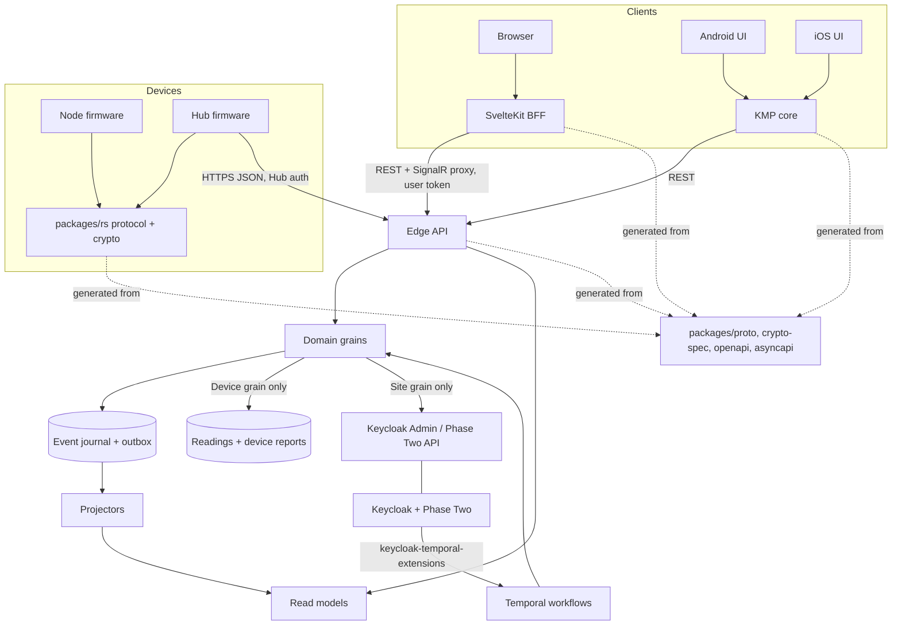
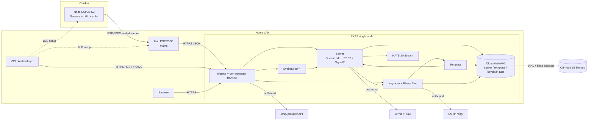
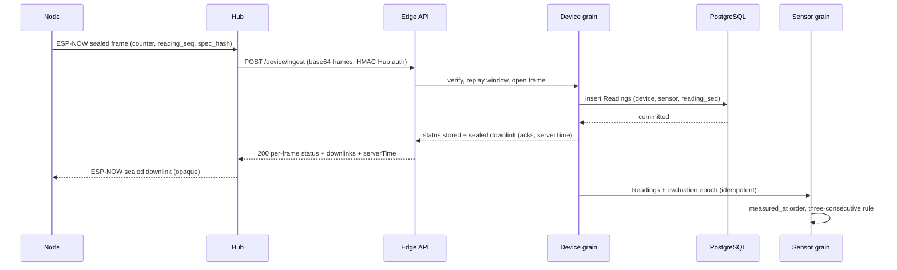
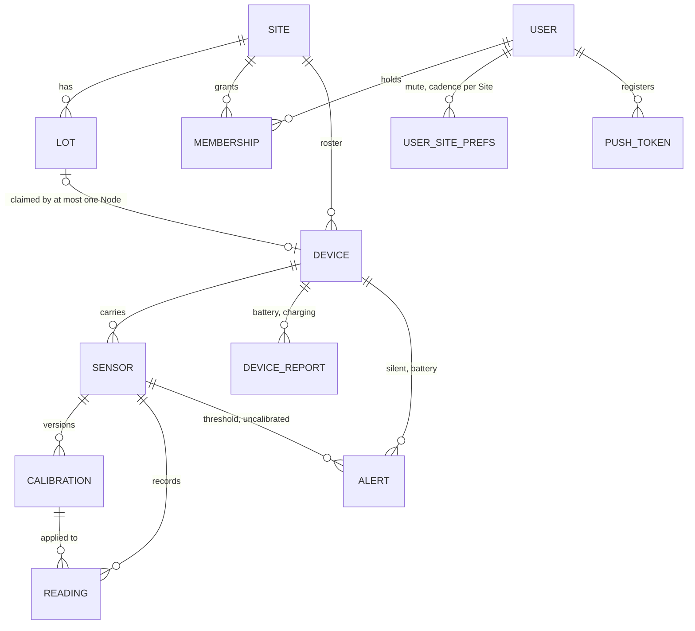

# Architecture Spine — Coldframe V1

Vocabulary follows the PRD §3 Glossary (Site, Lot, Device, Node, Hub, Sensor, Reading, Threshold, Alert, Reminder, Notification Window, Silence Window, Pause).

## Design Paradigm

**Actor model with event-sourced aggregates and CQRS projections.** Every domain entity is an Orleans grain that owns its state and is its only writer. Grain events land in one PostgreSQL event journal, which feeds read models. The REST API reads those read models. Devices never evaluate anything: they measure, seal, and send. The Hub is a relay that cannot read or forge anything it carries, in either direction.

| Layer | Lives in | Holds |
| --- | --- | --- |
| Devices | `apps/rs/node`, `apps/rs/hub`, `packages/rs/*` | Measurement, sealing, buffering (Node); relay only (Hub) |
| Edge API | `apps/cs/server` (ASP.NET Core endpoints) | Ingestion, REST/JSON, SignalR, authentication and authorization; no domain rules, only calls to grains |
| Domain | `apps/cs/server` grains, contracts in `packages/cs/*` | Grains: Site, Lot, Device, Sensor, Alert, User |
| Projections | `apps/cs/server` projectors → PostgreSQL | Read models (including Lot status and the identity projection), Readings table |
| Clients | `apps/ts/web`, `packages/kt/core`, `apps/kt/android`, `apps/swift/ios` | Rendering, BLE setup, OIDC; no domain status logic |

## Invariants & Rules



Arrows are the only allowed dependency and call directions. Grains never call the Edge API or read models. Clients never talk to Keycloak's Admin API, Temporal, NATS, or PostgreSQL. The browser never talks to the Server directly; it goes through the BFF.

### AD-1 — One owning grain per entity, the only writer

- **Binds:** all Server features (FR-2…FR-21)
- **Prevents:** two code paths mutating the same Device, Sensor, Alert, Lot, Site, or User state.
- **Rule:** Site, Lot, Device, Sensor, Alert, and User are grains keyed by stable IDs (see Consistency Conventions). The owning grain is the only writer of its entity's state. Read models are written only by projectors (AD-21). The Readings and device-report tables are written only by the Device grain (AD-9). API handlers change state only by calling a grain, and read state only from read models or grains. A grain never reads a read model. Every cross-entity invariant has exactly one enforcing grain (AD-18), and it is enforced by a synchronous grain call, never by a read-model check.

### AD-2 — Event-sourcing scope

- **Binds:** FR-2, FR-6, FR-9 … FR-18, FR-21
- **Prevents:** one epic event-sourcing an entity while another stores the same entity as mutable rows.
- **Rule:** Every domain grain is event-sourced (`JournaledGrain`, CustomStorage on the AD-21 journal):
  - **Site:** lifecycle, Owner set, Device roster, Site Pause, Site Reminder cadence
  - **Lot:** created, renamed, claimed, released, removed
  - **Device:** enrolled, assigned, moved, unassigned, pause sources, Silence Window, relay Hub
  - **Sensor:** Specification declared or changed, Thresholds, calibrated, evaluation state
  - **Alert**
  - **User:** Site set, Notification Window, time zone, mute per Site, cadence per Site, push tokens

  Not event-sourced: **Readings and device reports** (append-only tables are their log, AD-9) and the **identity projection** (a read model, AD-3).

### AD-3 — Keycloak is the identity authority; Site-scoped writes go through the Site grain  [ADOPTED]

- **Binds:** FR-5, FR-6, FR-7, NFR-2, NFR-6
- **Prevents:** two sources of truth for Site membership, races that leave a Site with no Owner, and a 403 on the first call after Create Site.
- **Rule:**
  - **What Keycloak owns:** accounts, passwords, and registration. The Server never writes Users.
  - **Who writes Sites, Memberships and Roles:** the Server alone, and within the Server only the **Site grain**. The Site grain checks FR-6 and FR-7 against its own persisted Owner set, then calls the Keycloak/Phase Two API, then persists the outcome. Calls on a given Site are serialized, so two concurrent Owner demotions cannot both succeed. The Site grain has a lifecycle (`Uncreated`, `Active`, `Deleted`). A Site-scoped call to an `Uncreated` grain returns 404.
  - **Create Site:** the Edge calls `User.CreateSite(idempotencyKey)`. The User grain persists the request and creates the Phase Two Organization, tagged with the idempotency key so a retry finds it instead of duplicating it. It then calls `Site(orgId).Initialize(owner)`.
  - **Read-your-writes:** Site-grain events update the identity projection straight away.
  - **Keycloak events:** they arrive through `keycloak-temporal-extensions` → Temporal → the Site and User grains, and are idempotent reconciliations.
  - **Break-glass edits:** edits made in the Keycloak admin console arrive through that same path. If one violates FR-7, the Site grain keeps its last valid Owner set for authorization and raises an operator-visible error. It never silently repairs the violation.
  - **Invitations:** they use Phase Two's native invitation flow (email, link, expiry). The Server holds no invitation deadline, and an accepted invitation arrives as a Membership event.

### AD-4 — Per-Site authorization from the projection

- **Binds:** FR-7, FR-10, FR-18, NFR-2, NFR-6
- **Prevents:** endpoints checking Roles differently, and revoked Roles staying effective until the token expires.
- **Rule:** Every non-Device request carries a Keycloak access token, which the Edge API validates. The caller's Role on the target Site is read from the identity projection (kept current by AD-3), never from token claims. Roles form one ordered set: `Owner > Administrator > Member`. Every endpoint declares its minimum Role in metadata, and one shared authorization policy enforces it. A Role on Site A grants nothing on Site B. NFR-6 is verified by a generated authorization-matrix test: every endpoint × every Role × own Site / other Site (AD-24).

### AD-5 — Infrastructure lanes

- **Binds:** all Server features
- **Prevents:** two epics picking different mechanisms for the same job.
- **Rule:**
  - **Orleans** holds all domain state and all business deadlines (Reminders, AD-6).
  - **PostgreSQL** holds every durable fact: the event journal, Readings, read models, and the Orleans tables.
  - **Temporal** carries only the Keycloak event pipeline (AD-3).
  - **NATS JetStream** backs Orleans streams only, behind one internal stream seam, using the pinned `Microsoft.Orleans.Streaming.NATS` provider. Streams are low-latency hints; no consumer relies on them alone for correctness (AD-21).
  - No Device, app, or external system connects to NATS or Temporal. Adding a messaging or scheduling mechanism requires amending this AD.

### AD-6 — Deadlines are persisted state; Reminders only wake

- **Binds:** FR-12, FR-13, FR-16, FR-18
- **Prevents:** lost summaries, Reminders, Pause ends, or Silence Alerts because an Orleans Reminder tick was skipped while the silo was down, and Server downtime being mistaken for Device silence.
- **Rule:**
  - Every deadline (Notification Window opening, next Reminder, Pause end, Silence Window expiry) is stored in the owning grain's state as a UTC `due-at`.
  - An Orleans Reminder is only a wake-up. On every wake **and** every activation, the grain processes **all** overdue deadlines. Reminder periods are at least 1 minute.
  - Silence is measured from `max(last accepted report, last Server start, last resume)`, so time the Server was down never counts as Device silence.

### AD-7 — Alert evaluation, identity, and delivery

- **Binds:** FR-9, FR-10 … FR-17, FR-20, FR-21
- **Prevents:** Alert logic split across components, duplicate open Alerts, two Reminder schedulers, Alerts about the past, and one Alert per Node when a Hub goes silent.
- **Rule:**
  - **Evaluation:**
    - The **Sensor grain** evaluates Threshold crossings: three consecutive Readings to open and to close (FR-11). It also evaluates the uncalibrated condition (FR-21). An uncalibrated calibrating Sensor opens no Threshold Alert. A Threshold change resets streaks.
    - The **Device grain** evaluates Silence (FR-13) and battery: three consecutive reports below 20 % and not charging (FR-14).
    - Evaluation runs in `measured_at` order and is monotonic per subject. A Reading older than the grain's `lastEvaluatedAt` is stored but not evaluated.
  - **Identity:**
    - `alertId = UUIDv5(subjectKind:subjectId:alertKind:episode)`, where `alertKind ∈ {threshold, uncalibrated, silent, battery}`. The episode counter is persisted by the evaluating grain before it calls the idempotent `Alert.Open`.
    - At most one open Alert exists per subject and kind. A Threshold Alert records its side.
    - **Only the grain that opened an Alert closes it.** Close reasons form an enum: `recovered`, `paused`, `unassigned`, `calibrated`, `removed`.
  - **Hub silence:** a Node's Silence evaluation is suppressed while its last relay Hub has an open `silent` Alert, and it restarts when that Hub recovers. The FR-13 rule is that a silent Hub is reported as the Hub, not as every Node behind it.
  - **Fan-out:**
    - Alert events are published per Site. The Site grain keeps the set of open Alerts.
    - The User grain keeps its own Site set, fed by Membership events (AD-3). On joining a Site it pulls that Site's open Alerts. On activation it reconciles against `Site.OpenAlerts()`.
  - **Delivery (only the User grain decides *when*):**
    - It owns Notification Window holding and summaries: one entry per open Alert; an Alert that closed while held is dropped.
    - It owns mute.
    - It owns every Reminder deadline, one per Alert. The interval resolves User → Site (cached from Site events) → default of once per day. Health Alerts use `max(resolved, 24 h)`.
    - *How* to notify goes through one **Notifier seam** (APNs, FCM, and SignalR via AD-14), which contains no timing or filtering logic.
    - Push payloads are self-contained: Lot, Sensor or Device, and condition in plain words, readable without reaching the Server (FR-15).
  - **Defaults:**
    - Notification Window 07:00–22:00
    - Silence Window: Node 6 h, Hub 5 min
    - Reminder cadence once per day
    - Low-battery threshold 20 %
    - Hub heartbeat every 30–60 s

### AD-8 — Pause and assignment gate at the Device grain

- **Binds:** FR-2, FR-18, NFR-9
- **Prevents:** several "is this paused?" checks, two stores of Pause state, and Sensor grains holding stale open-Alert state after a Pause.
- **Rule:**
  - **Pause state:** Pause is a set of sources on the Device grain, `pausedBy ⊆ {device, site}`, each with its own optional end date. A Device is paused if and only if the set is non-empty.
  - **Site Pause:** the Site grain owns Site Pause (state and end date) and propagates it idempotently to every Device in its roster (AD-18). Re-delivery is driven from persisted pending state. A Device joining a paused Site receives the Site's Pause in the join reply.
  - **Resume:** a Device resumes only when its last source clears, and its Silence Window restarts at that moment.
  - **Evaluation context:** on every change of assignment or Pause, the Device grain sends each of its Sensor grains an evaluation context: assigned, Lot, paused, epoch. A new epoch resets streaks. A paused or unassigned context makes the Sensor grain close its own open Alerts (AD-7). The Device grain closes only its Silent and Battery Alerts.
  - **Readings:** a Reading from a paused Device is acknowledged and discarded. A Reading from an unassigned Node is stored but not evaluated.
  - **Future commands (NFR-9):** issued only by the Device grain, and refused while it is paused.

### AD-9 — Ingestion, acknowledgement, and Readings storage

- **Binds:** FR-4, FR-8, FR-9, FR-14, NFR-3
- **Prevents:** a Node deleting a Reading the Server has not stored, one bad frame poisoning a batch, duplicates from resends, and history re-interpreted after recalibration.
- **Rule:**
  - **Envelope:** the Hub POSTs a JSON envelope of base64 sealed Node frames and holds no Readings. The Hub may keep, in volatile RAM only, the latest sealed downlink for each Node that missed its acknowledgement window (AD-17).
  - **Acknowledgement:**
    - The unit of acknowledgement is the Reading, identified by `(device_id, reading_seq)`.
    - The Server acknowledges only after the PostgreSQL commit. JetStream is never the durability point.
    - The response is HTTP 200 whenever the envelope parses. It carries one status per frame: `stored`, `duplicate`, `rejected_auth`, `rejected_replay`, `rejected_time`, `unknown_device`, or `retry`. Only `stored` and `duplicate` carry a sealed downlink acknowledgement (AD-12).
    - HTTP 4xx is returned only for an unparseable envelope or a failed Hub authentication, and 5xx only when nothing was processed.
    - The Hub never synthesizes an acknowledgement. The Node deletes a buffered Reading only on an authenticated downlink, and it buffers at least 24 h of Readings.
  - **Storage:**
    - Readings are unique by `(device_id, sensor_id, reading_seq)`. A duplicate is a no-op that is still acknowledged. Everything downstream is idempotent.
    - Readings live in one append-only, monthly-partitioned table, and a row is never updated or deleted. Each row stores the raw value, `measured_at`, and the ID of the Calibration in force.
    - Battery % and charging status go in an append-only device-reports table with the same keys.
  - **Calibration in force:**
    - The Sensor grain is the only writer of Calibration. `Sensor.Calibrate` synchronously sets the Calibration in force on the Device grain before it confirms, and re-delivers on failure. The Device grain treats the value as a read-only cache.
    - Calibration reference points are raw values of stored Readings the Administrator selects. They are submitted over REST, never over BLE.
    - Normalized values (0–100 %) are derived from the Calibration each Reading was stored with (FR-9).

### AD-10 — Wire contracts have one source each

- **Binds:** FR-1 … FR-4, FR-15, FR-19, FR-20, NFR-9, NFR-11
- **Prevents:** firmware, Server, apps, and web drifting on message shape.
- **Rule:**
  - **Contract sources:** every contract is authored in `packages/`, contract-first:
    - `packages/proto` (Protobuf) holds the ESP-NOW messages, the sealed Node frame, the sealed downlink, the Specification set, and the BLE setup messages. It is one protocol for both Hub and Node.
    - `packages/openapi` holds REST, including the Device endpoints `POST /device/ingest` and `POST /device/heartbeat`.
    - `packages/asyncapi` holds SignalR messages and push payloads.
    - `packages/crypto-spec` holds labels, algorithms, and test vectors (AD-12).
  - **Generated code:**
    - Devices use micropb. The Server uses Google.Protobuf and generated OpenAPI/AsyncAPI types. The KMP core and SvelteKit use generated clients.
    - The Hub's no_std JSON structs are hand-written, but CI validates them against golden fixtures generated from the OpenAPI schema. The Server is validated against the OpenAPI document in CI.
  - **Versioning:**
    - Every frame and envelope carries `protocol_version`. The Server accepts the current and the previous major.
    - Within a major version, changes are additive only. A Protobuf field number is never reused.
  - **Node ⇄ Hub radio:** channel discovery, the ESP-NOW peer scheme, and PHY/long-range settings (NFR-11) are part of the `packages/proto` Node ⇄ Hub contract, owned by the Hub epic.

### AD-11 — Time

- **Binds:** FR-4, FR-8, FR-16, FR-18
- **Prevents:** arrival-time stamps, forged or drifting Node clocks, TLS failing on a Hub with no clock, and Notification Windows evaluated in the wrong time zone.
- **Rule:**
  - **UTC:** every stored and transmitted timestamp is UTC: ISO-8601 with `Z` in JSON, and Unix time in milliseconds in Protobuf.
  - **Hub:** the Server is the time authority. The Hub bootstraps its clock with SNTP before its first TLS connection, then follows the `serverTime` in its TLS-authenticated responses. The Hub never stamps data.
  - **Node:** the Node sets its RTC only from **sealed downlinks** (AD-12). It slews gradually and never steps back more than 1 s at a time. A Node that has never been synced marks Readings `time_unsynced` with its boot ID and uptime, and the Server rebases them. The Server rejects a `measured_at` more than 5 min in the future (`rejected_time`).
  - **Users:** each User has one IANA time zone, stored as an event-sourced preference on the User grain. It is detected on first use: from the mobile OS time zone in the app, from the browser (`Intl` time zone, sent by the BFF) on the web, and from IP geolocation only as a last resort. Detection only proposes a value; the User confirms it or selects another. Clients never overwrite a zone the User chose themselves. Notification Windows are evaluated in that zone, including across daylight-saving changes.

### AD-12 — Device trust: hardware root, one key hierarchy, sealing in both directions

- **Binds:** FR-1, FR-2, FR-4, NFR-2, NFR-10
- **Prevents:** readable Device secrets, a Hub that can read or forge Readings, acks, time, or commands, and firmware and Server deriving different keys.
- **Rule:**
  - **Root:** on first boot, the Device generates a key from the TRNG with the radio on and burns it into a read-protected eFuse block (HMAC purpose ToUser). The root derives exactly one key: `K_dev = HMAC-SHA256_eFuse(root, "coldframe/device/v1")`.
  - **Purpose keys:** `HKDF-SHA256(K_dev, label)`, computed identically by the Device and the Server. The V1 labels are `seal/v1` (uplink), `ack/v1` (downlink), and `hub-auth/v1`.
  - **Enrolment:**
    - The KMP core fetches the Server's enrolment public key over REST (TLS, AD-13), shows its fingerprint, and writes it to the Device over BLE.
    - The Device returns `K_dev` sealed with HPKE (RFC 9180, X25519-HKDF-SHA256-ChaCha20Poly1305). The app relays only ciphertext.
    - The Server stores `K_dev` encrypted at rest.
  - **Sealing:** both the uplink (Node frame) and the downlink (acks, `serverTime`, commands) are sealed with ChaCha20-Poly1305 using a nonce built from the Device ID and a counter (AD-17). The Hub relays downlinks as opaque bytes.
  - **Hub authentication:** the Hub authenticates each request with an HMAC over method, path, body hash, timestamp and nonce, using its `hub-auth/v1` key, over TLS where only the Server has a certificate (no mTLS). The Server rejects timestamps more than ±5 min off.
  - **Single source:** labels, algorithms, nonce layout, and the enrolment message are defined once in `packages/crypto-spec` and `packages/proto`, and are generated into Rust and C#. Shared test vectors must pass in both CI pipelines.
  - **Dev mode:** a documented dev-mode build skips the eFuse burn and uses a software key. It is never enabled in release builds.

### AD-13 — TLS with public certificates on a LAN name

- **Binds:** NFR-1, NFR-10, FR-1, FR-5, FR-7
- **Prevents:** per-phone private-CA installation (the OIDC system browser ignores app trust stores), and plain-HTTP endpoints.
- **Rule:** Every IP endpoint (Server, Keycloak, web app) serves TLS with a publicly trusted certificate, issued through Let's Encrypt DNS-01 for a real domain. Split DNS resolves that domain to the LAN ingress. There is no inbound internet traffic and no plain-HTTP listener. The Hub and the apps trust public roots only. A private CA is a documented fallback, not a supported path. ESP-NOW is not IP; AD-12 protects it.

### AD-14 — Client boundaries and server-computed status

- **Binds:** FR-8, FR-15, FR-19, FR-20
- **Prevents:** protocol or status logic duplicated across clients, tokens exposed to the browser, and a browser that cannot authenticate to SignalR.
- **Rule:**
  - **Status is computed once, on the Server,** as a read model exposed through OpenAPI. `LotStatus ∈ {needsWater, ok, unknown, paused, noNode}`, with `statusSince`, `lastReadingAt`, and the FR-8 sort order.
    - `needsWater`: an open low-side Threshold Alert on a soil-moisture Sensor of the Lot's Node.
    - `unknown`: an open Silent Alert on the Node or on its relay Hub.
  - **Clients only render.** Their own logic is limited to transport staleness: data age and Server unreachable.
  - **KMP core** (`packages/kt/core`): it alone implements BLE (Kable), Hub provisioning, Node identification and enrolment, OIDC (Authorization Code + PKCE), the API client, and push-token registration. Push tokens are owned by the User grain. The SwiftUI and Jetpack Compose shells hold UI only.
  - **SvelteKit** is a BFF: OIDC runs server-side through `@escendit/sveltekit-auth-keycloak`, and the browser holds only a session cookie. The browser reaches SignalR only through the BFF, which proxies it and attaches the user's token.
  - **SignalR** carries exactly two message families, defined in `packages/asyncapi`:
    - `notification.delivered`: only from the Notifier, already windowed and muted.
    - `readmodel.changed`: invalidation hints carrying no domain data. Clients refetch over REST.

### AD-15 — Deployment envelope

- **Binds:** NFR-1, NFR-3, NFR-7, NFR-8
- **Prevents:** state stranded in pods, unreproducible installs, secrets in Git, and unrecoverable data loss on a single node.
- **Rule:**
  - **Platform:** single-node RKE2, with Fleet pulling the Helm charts in `deploy/`. The Compose file is a reference example only. Environments are local (Aspire AppHost, dev only) and the reference deployment; there is no staging.
  - **State:** Server pods are stateless. All durable state lives in one CloudNativePG cluster, with separate databases for Server/Orleans, Temporal, and Keycloak. JetStream is disposable.
  - **Backups:** CNPG backups (Barman Cloud) with WAL archiving go to an adopter-provided S3-compatible target off the node. Restore is documented and tested. After a restore, the Server advances every Device's replay window by a safety margin (AD-17).
  - **Secrets:** Kubernetes Secrets with fixed names and keys, listed in `deploy/`, created by the adopter out of band. Charts never template secret values. Nothing secret is in Git.
  - **Upgrades:** with a single silo, an upgrade is stop-then-start. Migrations run first (AD-22).
  - **Dependencies:** every dependency is obtainable from a public registry or public repository. .NET versions are pinned through Central Package Management, and no transitive dependency is allowed to float. The Keycloak extension JARs (`keycloak-temporal-extensions`) must be verified against the Keycloak version of the Phase Two image in use. That compatibility is re-checked whenever either one is upgraded.
  - **Service defaults:** .NET services use the Escendit service defaults (`Escendit.Extensions.Hosting.*`, `Escendit.AspNetCore.Builder.*`) for OpenTelemetry, health, and configuration.

### AD-16 — Room for Device commands (reserved, not built in V1)

- **Binds:** NFR-9
- **Prevents:** a later irrigation feature needing a new transport or reworking Sites, Lots, Sensors, or Alerts.
- **Rule:** A Device declares its capabilities alongside its Sensor Specifications (V1: sensing only). A future command is a Device-grain event (AD-8). It is carried in the sealed downlink (AD-12), so the Hub can neither read nor forge it. It may require user confirmation, can be stopped manually, and is refused while the Device is paused. V1 defines no command types; the downlink reserves an empty `commands` field.

### AD-17 — Frame sequence and replay

- **Binds:** FR-4, NFR-3
- **Prevents:** resent Readings that are never acknowledged, nonce reuse under a fixed key after a reboot, and duplicate Readings from a clock step.
- **Rule:**
  - **Counter:** each direction has a 64-bit counter that never repeats for the life of the key. The Node persists a counter reservation in flash in blocks: on boot it jumps to the stored ceiling and raises the ceiling before sealing anything.
  - **Resend:** every transmission is freshly sealed with a new counter, including a resend. A buffered Reading keeps its payload (`reading_seq`, `measured_at`, value), not its sealed bytes. `reading_seq` is a per-Device counter persisted the same way.
  - **Replay window:** the Server accepts an authentic frame whose counter is above the Device's high-water mark, or inside an unseen slot of a 64-entry window below it. Anything else is `rejected_replay`.
  - **Duplicates:** duplicate *Readings* are caught by the AD-9 key, never by the counter.
  - **Acknowledgement window:** the Node waits **300 ms** for its downlink acknowledgement. This value comes from the Hub radio spike (`docs/spikes/hub-radio-coexistence.md`) and will be re-measured against the real Server. Only the sealed acknowledgement counts as delivery; the radio-level send status is ignored. If the Node misses the window, it collects the acknowledgement on its next wake from the Hub's volatile downlink slot, and it re-scans channels after repeated misses.

### AD-18 — Relationship and invariant ownership

- **Binds:** FR-1, FR-2, FR-6, FR-18
- **Prevents:** two Nodes on one Lot, Nodes on removed Lots, and two owners of the Site–Device relationship.
- **Rule:**
  - **Lot occupancy:** owned by the Lot grain. Assigning Node *n* to Lot *L* means the Device grain calls `L.Claim(n)`. The claim succeeds only if *L* exists, is not removed, and is free or already held by *n*. The Device grain then persists `DeviceAssigned`.
  - **Move:** claim the new Lot, persist `DeviceMoved`, then release the old Lot. The release is idempotent and retried from persisted pending state. A claimed Lot refuses removal.
  - **Source of truth:** the Device grain is the only source of "which Lot am I on". Reading history follows the Node across moves (FR-2).
  - **Site–Device:** the Device grain owns its `siteId`. It joins by calling `Site.RegisterDevice(deviceId, kind)` before persisting `DeviceEnrolled`, and the Site grain owns the roster.
  - **Hub relay:** any enrolled Hub may relay any Node's frames. Hub–Site binding is used only for display and for Silence suppression (AD-7), never to decide whether a frame is accepted.

### AD-19 — Sensor identity and Specifications

- **Binds:** FR-3, FR-9, FR-10
- **Prevents:** an undefined `sensor_id` on the wire, Threshold overrides wiped by redeclaring a Specification, and two places validating Thresholds.
- **Rule:**
  - **Identity:** `sensorId = UUIDv5(deviceId:slot:quantity)`, computed identically on both sides. `slot` is the index in the Protobuf Specification set.
  - **Declaration:** every frame carries a `spec_hash`. The Node sends the full set only when the downlink reports the hash unknown. Redeclaring the same hash is a no-op.
  - **Changed Specification:** a changed Specification updates **defaults only**. A new measured quantity at a slot creates a new Sensor.
  - **Thresholds:** each side is stored as `Default | Override(value) | Cleared`, and a declaration never replaces an override. The Sensor grain alone validates Thresholds (low < high; low required when alerting) and computes the proposed low default, `Min + 20 % × (Max − Min)` (FR-10).
  - **Undeclared slots:** Readings for an undeclared slot are stored and acknowledged, but not evaluated until the declaration arrives.

### AD-20 — Removal is a tombstone

- **Binds:** FR-2, FR-6, FR-7, FR-8
- **Prevents:** one epic hard-deleting while another keeps history, and orphaned open Alerts or Reminders.
- **Rule:** Entities are never hard-deleted. Removal is a `…Removed` event plus a tombstone. The owning grains first close the entity's open Alerts with reason `removed` (AD-7). Readings and history stay queryable by ID, and Readings are retained indefinitely (FR-8). When a Site deletion arrives from Keycloak, the Site grain moves to `Deleted` and suspends its roster.

### AD-21 — Event journal and distribution

- **Binds:** all Server features, NFR-3
- **Prevents:** projections that silently diverge when JetStream is wiped, serializer drift, and events that can no longer be replayed after an upgrade.
- **Rule:**
  - **The journal:** every journaled event goes to **one PostgreSQL event table** (stream ID, version, type, schema version, JSON payload, recorded time, global position), serialized with System.Text.Json from contracts in `packages/cs`. Each contract has a stable alias.
  - **Outbox:** an event and its outbox row are appended in one transaction.
  - **Projectors:** they read the journal by global position, keep a checkpoint in PostgreSQL, and can rebuild from position 0. Orleans streams (NATS) are wake-up hints only, and every consumer must converge with streams disabled.
  - **Delivery:** at-least-once, and every consumer is idempotent by (stream ID, version).
  - **Event evolution:** an old event version is never removed from code. It stays readable through `Apply` or through one registered upcaster.
  - **Snapshots:** taken on a fixed event interval.

### AD-22 — Schema migrations and partitions

- **Binds:** NFR-3, NFR-7
- **Prevents:** mixed migration mechanisms across epics, and ingestion halting because next month's Readings partition does not exist.
- **Rule:**
  - **One migration set:** all Server database schema lives in one forward-only migration set. It covers the Orleans ADO.NET scripts, the journal, read models, and Readings. The tool is FluentMigrator. The Orleans cluster schema (storage, clustering, and reminders) comes from the `Escendit.Orleans.Migrations.Cluster.PostgreSQL` package, built from the public `escendit/migrations-cluster-postgresql` repository. Coldframe's own migrations follow the same pattern. The package version follows the Orleans version its schema matches, and it is upgraded together with Orleans.
  - **Execution:** migrations run as a Kubernetes Job before the silo starts, and application startup never runs DDL.
  - **Partitions:** Readings and device-report partitions are created at least two months ahead, with a default partition as a safety net.

### AD-23 — Build and release

- **Binds:** NFR-7, NFR-8
- **Prevents:** per-app version schemes, unpinned artifacts, and wire majors that Devices cannot follow.
- **Rule:**
  - **CI and images:** CI runs on GitHub Actions, and images are published to `ghcr.io/escendit/coldframe/<component>`, multi-arch where supported.
  - **Versioning:** one SemVer per release tag across the monorepo, and the Helm chart appVersion equals that tag.
  - **Firmware:** released as binaries per tag and flashed over USB in V1.
  - **Mobile:** adopters build the mobile apps from source, with their own push credentials.
  - **Wire compatibility:** a wire-major bump (AD-10) ships only in a release whose Server still accepts the previous major.

### AD-24 — Test obligations that guard the contracts

- **Binds:** NFR-6, AD-4, AD-10, AD-12, AD-21
- **Prevents:** contract drift and authorization regressions that the single field-tested Site would never reveal.
- **Rule:** These CI checks gate every merge:
  - the generated authorization matrix (AD-4)
  - crypto test vectors in Rust and C# (AD-12)
  - Protobuf and OpenAPI/AsyncAPI compatibility checks against the previous release (AD-10)
  - golden Hub JSON fixtures (AD-10)
  - a replay of all events against a fixture journal (AD-21)
  - Orleans grain tests for every AD-7 and AD-8 transition, using the test cluster

## Consistency Conventions

| Concern | Convention |
| --- | --- |
| Naming | PRD Glossary terms verbatim in code, API, and UI (`Lot`, not `Bed`; `Reading`, not `Measurement`). Events are past-tense `<Entity><Verb>ed` (`AlertOpened`, `SensorCalibrated`). REST resources are plural nouns under `/sites/{siteId}/…`. |
| IDs | Site ID = Keycloak Organization ID; User ID = OIDC `sub`; Device ID derived from the eFuse-bound identity at enrolment; Sensor ID and Alert ID are deterministic UUIDv5 (AD-19, AD-7); Lot and everything else Server-created uses UUIDv7. |
| Idempotency | Every creating `POST` accepts an `Idempotency-Key` header, stored by the owning grain for 24 h. |
| Dates | UTC everywhere (AD-11). |
| Errors | RFC 9457 Problem Details on every REST error; 403 for a missing Role and 404 for a non-existent Site, each with a stable `type` URI. |
| JSON | camelCase fields; enums as strings; absent optional fields are omitted, not null; lists are cursor-paginated; history queries take `from`/`to`. |
| Units | Calibrating Sensors expose 0–100 %; others use their Specification unit (°C, %RH, Ω). |
| Config | Environment variables only in deployed services. |
| Logging and tracing | OpenTelemetry through the Escendit service defaults; no Reading payloads, keys, or tokens in logs. |
| Commits | Conventional Commits with a scope per app or package (`feat(server): …`). |

## Stack

| Name | Version |
| --- | --- |
| esp-hal (ESP32-S3; `unstable` for HMAC/AES/SHA; Wi-Fi + BLE + ESP-NOW coexistence validated by the spike) | 1.2.2 |
| esp-radio (Wi-Fi, BLE, ESP-NOW, coex) | 1.0.0-beta.1 |
| trouble-host (BLE host; bt-hci 0.9 to match esp-radio) | 0.7.0 |
| mbedtls-rs (Hub TLS client) | 0.3.0 |
| reqwless (Hub HTTP client, no default features, over mbedtls-rs) | 0.14.0 |
| micropb / micropb-gen (Protobuf, no_std) | 0.6.0 |
| chacha20poly1305 (firmware AEAD, no default features) | 0.11.0 |
| .NET | 10 (LTS) |
| Microsoft Orleans (+ AdoNet, Hosting.Kubernetes, EventSourcing), pinned via Central Package Management | 10.3.1 |
| Microsoft.Orleans.Streaming.NATS (pinned) | 10.3.1-alpha.1 |
| NATS.Net (transitive, pinned to 2.x) | 2.8.2 |
| Google.Protobuf | 3.36.2 |
| FluentMigrator (+ Runner.Postgres, Extensions.Postgres) | 8.0.1 |
| Escendit.Orleans.Migrations.Cluster.PostgreSQL | 10.3.1-rc.0 |
| NATS Server (JetStream) | 2.15.0 |
| Temporal Server / Temporalio .NET SDK | 1.31.3 / 1.19.0 |
| Escendit.Extensions.Hosting.* | 0.1.0-rc.4 |
| Escendit.AspNetCore.Builder.* | 0.1.0-rc.0 |
| PostgreSQL | 18 |
| CloudNativePG | 1.30.1 |
| Keycloak (Phase Two image) + keycloak-orgs | phasetwo-keycloak 26.6.7 + 0.182 |
| keycloak-temporal-extensions (verified on phasetwo-keycloak 26.6.7) | v0.0.1-rc.2 |
| SvelteKit / Svelte | 2.70.3 / 5.57.1 |
| @escendit/sveltekit-auth-keycloak + @escendit/sveltekit-session | 0.1.0-rc.12 |
| Kotlin / Kable / kotlin-multiplatform-oidc | 2.4.20 / 0.45.0 / 0.18.3 |
| Aspire (dev AppHost) | 13.5.4 |
| RKE2 (stable channel) | v1.36.4+rke2r1 |
| Ingress | RKE2-bundled Traefik |
| cert-manager | 1.21.2 |
| Fleet | v0.16.2 |

## Structural Seed

### Containers



### Reading path



### Core entities



### Source tree

```text
coldframe/
  apps/
    rs/node/  rs/hub/        # firmware
    cs/server/               # Orleans silo, Edge API, SignalR, projectors, migrations
    ts/web/                  # SvelteKit BFF
    kt/android/  swift/ios/  # native UI shells
  packages/
    proto/                   # Protobuf: ESP-NOW, sealed frames, BLE setup, Specifications
    openapi/                 # REST contract (incl. /device/*)
    asyncapi/                # SignalR messages + push payloads
    crypto-spec/             # labels, algorithms, nonce layout, test vectors
    rs/protocol/ rs/crypto/  # generated Protobuf, key derivation, sealing
    cs/                      # grain interfaces, event contracts, generated types
    kt/core/                 # KMP shared core
    ts/api-client/           # generated TS client
  aspire/                    # local dev AppHost
  deploy/                    # Helm charts + Fleet bundles, Secret manifest list, Compose example
  hardware/                  # Node/Hub schematics, PCB, enclosure
  docs/                      # adopter build guide, learning reference
```

`apps/` holds runtimes and `packages/` holds what they reference: language-neutral contracts in their own folders, shared code split by language. The top level holds everything that is not code.

## Capability → Architecture Map

| Capability / Area | Lives in | Governed by |
| --- | --- | --- |
| FR-1 Hub provisioning | KMP core, Hub firmware, Device + Site grains | AD-10, AD-12, AD-13, AD-18 |
| FR-2 Node pairing and assignment | KMP core, Node firmware, Device + Lot grains | AD-8, AD-12, AD-18 |
| FR-3 Sensor Specifications | `packages/proto`, Sensor grain | AD-19 |
| FR-4 Report Readings | Node, Hub, Edge API, Device grain | AD-9, AD-11, AD-12, AD-17 |
| FR-5 – FR-7 Sign-in, Sites, Lots, Memberships | Keycloak + Phase Two, Site/User/Lot grains, Temporal pipeline | AD-3, AD-4, AD-18, AD-20 |
| FR-8 View Readings | LotStatus and history read models, clients | AD-9, AD-14 |
| FR-9 Calibration | Sensor grain, Readings table | AD-9, AD-19 |
| FR-10 – FR-12 Thresholds, Threshold Alerts, Reminders | Sensor, Alert, User grains | AD-6, AD-7, AD-19 |
| FR-13, FR-14, FR-21 Health Alerts | Device, Sensor, Alert grains | AD-6, AD-7 |
| FR-15 – FR-17, FR-20 Notification delivery | User grain, Notifier seam, SignalR via BFF | AD-7, AD-11, AD-14 |
| FR-18 Pause | Device + Site grains | AD-6, AD-8 |
| FR-19 Mobile apps | KMP core + native shells | AD-14 |
| NFR-1, NFR-10 Local-first, TLS | Ingress, DNS | AD-13, AD-15 |
| NFR-2 Authenticated access | Edge API policy, Hub auth | AD-4, AD-12 |
| NFR-3 Durability | PostgreSQL via CNPG, Node buffer | AD-6, AD-9, AD-17, AD-21 |
| NFR-4, NFR-5 Energy autonomy, outdoor survival | Node firmware, `hardware/` | AD-17 (bounded radio time); detail in firmware and hardware epics |
| NFR-6 Multi-Site correctness | CI | AD-4, AD-24 |
| NFR-7, NFR-8 Reproducibility, open source | `deploy/`, `docs/`, `hardware/`, CI | AD-15, AD-22, AD-23 |
| NFR-9 Room for irrigation | Device grain, sealed downlink | AD-8, AD-16 |
| NFR-11 Reach | Node ⇄ Hub radio contract | AD-10 |

## Deferred

| Item | Why it can wait |
| --- | --- |
| BLE provisioning protocol choice (PRD OQ2) | Decided by the first epic that needs it. AD-10 already binds it to one protocol for Hub and Node, defined in `packages/proto`. |
| Soil probe, sealing, temperature compensation (PRD OQ4) | Hardware. AD-9 stores raw values with a Calibration ID, so a compensation model can be added later. |
| DS-peripheral (RSA) asymmetric identity; secure boot; flash encryption | Hardening after V1. AD-12's versioned labels leave room. Each is an irreversible eFuse decision per board. |
| Firmware OTA | V1 flashes over USB (AD-23). OTA would ride the AD-16 command path and needs secure boot first. |
| gRPC or WebSocket transports | REST/JSON first. Could be added beside it later without touching `packages/proto`. |
| Production telemetry backend | PRD §6 excludes Server monitoring in V1. OpenTelemetry is already emitted. |
| Minimum hardware and ARM64 support statement | Needs the measured footprint of the full stack (deploy epic). |
| Keycloak registration policy (self-registration vs invite-only) | A realm setting. AD-3 holds either way. |
| Web session store | One web replica needs no shared store. Revisit if it scales out. |
